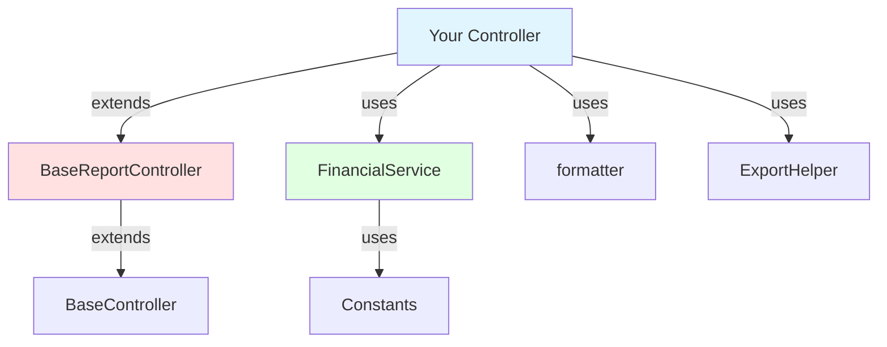
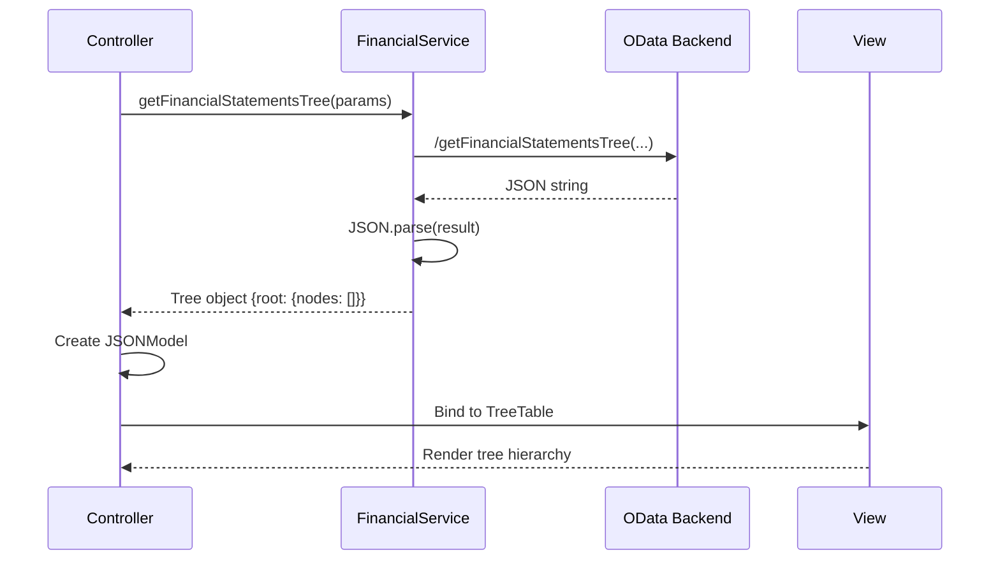

# Shared Library Documentation

> **Quick Stats**: 📦 6 apps using • 💾 ~20KB saved • 🔧 Zero code duplication

A centralized library of reusable controllers, services, formatters, and utilities for SAP UI5 financial analytics applications.

## Purpose

This shared library eliminates code duplication across custom financial analytics apps by providing:

- ✅ **Base controllers** with built-in period selection and data fetching
- ✅ **FinancialService** for OData operations and tree building
- ✅ **Formatters** for currency and percentage display
- ✅ **Constants** for standardized configuration
- ✅ **Export helpers** for Excel spreadsheet generation

---

## Table of Contents

- [Quick Start](#quick-start)
- [Core Components](#core-components)
- [Common Patterns](#common-patterns)
- [Quick Reference](#quick-reference)
- [Troubleshooting](#troubleshooting)
- [Best Practices](#best-practices)

---

## Quick Start

### 1. Setup Resource Root

Add the shared library to your `launchpad.html`:

```javascript
data-sap-ui-resourceroots='{
    "shared": "/shared",
    "yourapp": "/your-app/webapp"
}'
```

### 2. Import and Use

Simplest example - using the formatter:

```javascript
sap.ui.define([
    "sap/ui/core/mvc/Controller",
    "shared/model/formatter"
], function (Controller, formatter) {
    "use strict";

    return Controller.extend("myapp.controller.Main", {
        formatter: formatter,  // Make available to view

        onInit: function() {
            var amount = 1234567.89;
            console.log(formatter.formatCurrency(amount)); // "1.234.567"
        }
    });
});
```

### 3. Complete Minimal Example

Financial report with period selection:

```javascript
sap.ui.define([
    "shared/controller/BaseReportController",
    "shared/model/formatter"
], function (BaseReportController, formatter) {
    "use strict";

    return BaseReportController.extend("myapp.controller.Report", {
        formatter: formatter,

        // Override abstract method from BaseReportController
        loadData: function() {
            var range = this._getPeriodRange(); // Inherited helper

            // Use inherited FinancialService
            this._oFinancialService.getFinancialStatementsTree(
                "PNL",
                { year: range.startYear, monthFrom: range.startMonth, monthTo: range.startMonth },
                { year: range.endYear, monthFrom: range.endMonth, monthTo: range.endMonth }
            ).then(function(oTree) {
                // Bind to view
                var oModel = new sap.ui.model.json.JSONModel(oTree);
                this.getView().setModel(oModel, "report");
            }.bind(this));
        }
    });
});
```

> **Note**: BaseReportController automatically initializes FinancialService, loads available years, and sets up period selection defaults.

### Architecture Overview



---

## Core Components

### Controllers

<details>
<summary><b>BaseController</b> - Foundation for all controllers</summary>

**Purpose**: Provides version dialog and generic data fetching utilities.

**When to use**: Base class for simple controllers that don't need period selection.

**Key Methods**:

- `onVersionPress()` - Opens version information dialog
- `_fetchData(techInfoKey, modelName, fetchPromise)` - Generic data fetcher with tech info updates

</details>

<details>
<summary><b>BaseReportController</b> - For financial reports with periods (⭐ Most Common)</summary>

**Purpose**: Extends BaseController with period selection, FinancialService initialization, and report-specific lifecycle.

**When to use**: Any financial report that needs period range selection (LTM reports, pivot tables, etc.).

**Lifecycle**:

1. `onInit()` - Creates `this._oFinancialService` instance
2. `onBeforeRendering()` - Calls `_initViewSettings()`, `_loadAvailableYears()`, `loadData()`
3. `onPeriodUpdate()` - Triggered when period changes, calls `loadData()`

**Key Methods**:

- `loadData()` - **ABSTRACT** - Override in your controller to fetch and bind data
- `_getPeriodRange()` - Returns `{startYear, startMonth, endYear, endMonth}` (integers)
- `_loadAvailableYears()` - Fetches years from backend, updates viewSettings model
- `_initViewSettings()` - Creates viewSettings model with LTM defaults (last 12 months)

**Models Created**:

- `viewSettings` - Contains years, months, ltm period selection

**Example**:

```javascript
return BaseReportController.extend("app.controller.Main", {
    loadData: function() {
        var range = this._getPeriodRange();
        this._oFinancialService.getRevenueLTM(
            range.startYear, range.startMonth,
            range.endYear, range.endMonth
        ).then(function(result) {
            this.getView().setModel(new JSONModel(result), "data");
        }.bind(this));
    }
});
```

</details>

### Services & Models

<details>
<summary><b>FinancialService</b> - OData operations and tree building</summary>

**Purpose**: Centralized service for fetching financial data from backend OData functions.

**Constructor**: `new FinancialService(this.getOwnerComponent())`

**Top 5 Methods**:

| Method | Purpose | Returns |
|--------|---------|---------|
| `getFinancialStatementsTree(fsType, periodA, periodB)` | Fetch P&L or Balance Sheet tree | `Promise<object>` tree |
| `getRevenueLTM(startYear, startMonth, endYear, endMonth)` | Fetch revenue LTM with columns | `Promise<object>` rows+columns |
| `getPivotTree(startYear, startMonth, endYear, endMonth)` | Fetch pivot tree | `Promise<object>` tree |
| `getGLTotals(filters)` | Get aggregated GL totals | `Promise<object>` totals |
| `getAvailableYears()` | Get distinct years from data | `Promise<Array<string>>` years |

**Period Parameter Format**:

```javascript
// Format 1: Object (for tree methods)
{ year: 2025, monthFrom: 1, monthTo: 12 }

// Format 2: Individual params (for LTM methods)
startYear: 2024, startMonth: 1, endYear: 2025, endMonth: 12
```

**Example**:

```javascript
// In controller onInit
this._oFinancialService = new FinancialService(this.getOwnerComponent());

// Fetch data
this._oFinancialService.getFinancialStatementsTree(
    "PNL",
    { year: 2024, monthFrom: 1, monthTo: 12 },
    { year: 2025, monthFrom: 1, monthTo: 12 }
).then(function(tree) {
    // tree.root.nodes contains hierarchical data
});
```

</details>

<details>
<summary><b>Constants</b> - Configuration and metadata</summary>

**Purpose**: Centralized configuration constants for financial apps.

**Categories**:

| Category | Usage | Example |
|----------|-------|---------|
| `ModelConfig` | Model size limits | `SIZE_LIMIT: 100000` |
| `FSType` | Financial statement types | `PNL`, `BAS` |
| `SortConfig` | Sorting configurations | `PNL: ["8", "7", "4", "9"]` |
| `Headers` | Display labels | `GrossMargin: "Gross Margin (8000 + 7000)"` |
| `TechInfo` | Technical metadata | DB table, entity, filters |
| `GLViewModes` | Column visibility configs | Details, Account, Journal |
| `ExportConfig` | Export column definitions | GL columns, Pivot columns |
| `EntityPaths` | OData entity paths | `/Controls`, `/Dump` |

**Usage**:

```javascript
sap.ui.define(["shared/model/Constants"], function (Constants) {
    // Access constants
    var fsType = Constants.FSType.PNL;
    var sortOrder = Constants.SortConfig.PNL;
    var glColumns = Constants.ExportConfig.GL;
});
```

</details>

<details>
<summary><b>formatter</b> - Display formatters</summary>

**Purpose**: Utility functions for formatting numbers in views and controllers.

**Methods**:

- `formatCurrency(value)` - Formats as German locale currency (no decimals)
  - Input: `1234567.89` → Output: `"1.234.567"`
  - Handles null/undefined → `""`

- `formatPercentage(value)` - Formats as percentage with 1 decimal
  - Input: `45.678` → Output: `"45.7 %"`
  - Handles null/undefined → `""`

**Usage in Controller**:

```javascript
return Controller.extend("app.Main", {
    formatter: formatter,  // Expose to view

    onInit: function() {
        var amount = formatter.formatCurrency(1234567);
    }
});
```

**Usage in View**:

```xml
<Text text="{
    path: 'model>amount',
    formatter: '.formatter.formatCurrency'
}" />
```

</details>

<details>
<summary><b>ExportHelper</b> - Excel export utility</summary>

**Purpose**: Simplified Excel export with automatic busy state management.

**Method**: `export(settings, table)`

**Parameters**:
- `settings` - Spreadsheet configuration object
- `table` (optional) - Table control to clear busy state

**Usage**:

```javascript
sap.ui.define(["shared/model/ExportHelper"], function (ExportHelper) {
    onExport: function() {
        var oTable = this.byId("myTable");
        oTable.setBusy(true);

        var settings = {
            workbook: { columns: aCols },
            dataSource: aData,
            fileName: "Export.xlsx",
            worker: false
        };

        ExportHelper.export(settings, oTable)
            .catch(function(err) {
                console.error("Export failed", err);
            });
    }
});
```

</details>

---

## Common Patterns

### Pattern A: Financial Report with BaseReportController

**Best for**: P&L, Balance Sheet, Revenue reports with period selection

```javascript
sap.ui.define([
    "shared/controller/BaseReportController",
    "shared/model/formatter",
    "shared/model/ExportHelper",
    "sap/m/MessageBox"
], function (BaseReportController, formatter, ExportHelper, MessageBox) {
    "use strict";

    return BaseReportController.extend("myapp.controller.Financial", {
        formatter: formatter,

        // Override abstract method
        loadData: function() {
            var range = this._getPeriodRange();

            this._oFinancialService.getFinancialStatementsTree(
                "PNL",
                { year: range.startYear, monthFrom: 1, monthTo: 12 },
                { year: range.endYear, monthFrom: 1, monthTo: 12 }
            ).then(function(oTree) {
                var oModel = new sap.ui.model.json.JSONModel(oTree);
                oModel.setSizeLimit(100000);
                this.getView().setModel(oModel, "financial");
            }.bind(this))
            .catch(function(err) {
                MessageBox.error("Failed to load data: " + err.message);
            });
        },

        onExport: function() {
            var oTable = this.byId("financialTable");
            oTable.setBusy(true);

            var oSettings = {
                workbook: {
                    columns: [
                        { label: "Account", property: "name", type: "String" },
                        { label: "Amount A", property: "amountA", type: "Number" },
                        { label: "Amount B", property: "amountB", type: "Number" }
                    ],
                    hierarchyLevel: "Level"
                },
                dataSource: this.getView().getModel("financial").getData().root.nodes,
                fileName: "FinancialStatements.xlsx",
                worker: false
            };

            ExportHelper.export(oSettings, oTable);
        }
    });
});
```

### Pattern B: Custom Controller with FinancialService

**Best for**: Custom apps with specific initialization or non-standard layouts

```javascript
sap.ui.define([
    "sap/ui/core/mvc/Controller",
    "shared/model/FinancialService",
    "shared/model/formatter",
    "shared/model/Constants"
], function (Controller, FinancialService, formatter, Constants) {
    "use strict";

    return Controller.extend("myapp.controller.Main", {
        formatter: formatter,

        onInit: function() {
            // Manually create FinancialService
            this._oFinancialService = new FinancialService(this.getOwnerComponent());
            this._loadData();
        },

        _loadData: function() {
            this._oFinancialService.getControlsData().then(function(aData) {
                var aTransformed = this._oFinancialService.transformControlsData(aData);
                var oModel = new sap.ui.model.json.JSONModel({ rows: aTransformed });
                this.getView().setModel(oModel, "controls");
            }.bind(this));
        }
    });
});
```

### Pattern C: Export with Formatting

**Best for**: Exporting data with formatted currency values

```javascript
onExportGL: function() {
    var oTable = this.byId("glTable");
    var aCols = [];

    // Build columns based on visibility
    Constants.ExportConfig.GL.forEach(function(colDef) {
        if (this.byId(colDef.id).getVisible()) {
            aCols.push({
                label: colDef.label,
                property: colDef.property,
                type: colDef.type,
                scale: colDef.scale
            });
        }
    }.bind(this));

    oTable.setBusy(true);

    ExportHelper.export({
        workbook: { columns: aCols, context: { sheetName: "General Ledger" } },
        dataSource: oTable.getBinding("rows"),
        fileName: "GeneralLedger.xlsx",
        worker: false
    }, oTable);
}
```

### Data Flow: Tree-Based Reports



---

## Quick Reference

### FinancialService Methods

| Method | Purpose | Returns |
|--------|---------|---------|
| `getFinancialStatementsTree(fsType, periodA, periodB)` | P&L or Balance Sheet tree | `Promise<object>` |
| `getSalesTree(periodA, periodB)` | Sales/revenue tree | `Promise<object>` |
| `getCombinedTree(periodA, periodB)` | Combined financial tree | `Promise<object>` |
| `getPivotTree(startYear, startMonth, endYear, endMonth)` | Pivot tree structure | `Promise<object>` |
| `getRevenueLTM(startYear, startMonth, endYear, endMonth)` | Revenue LTM with columns | `Promise<object>` |
| `getControlsData()` | Financial controls data | `Promise<Array>` |
| `getPivotData()` | Raw pivot data | `Promise<Array>` |
| `getGLTotals(filters)` | Aggregated GL totals | `Promise<object>` |
| `getAvailableYears()` | Distinct years | `Promise<Array<string>>` |
| `transformControlsData(data)` | Add totals and spacers | `Array` |

### Constants Categories

| Category | Purpose | Example Value |
|----------|---------|---------------|
| `ModelConfig` | Model configuration | `SIZE_LIMIT: 100000` |
| `FSType` | Financial statement types | `{PNL: "PNL", BAS: "BAS"}` |
| `SortConfig` | Sort orders | `{PNL: ["8","7","4","9"]}` |
| `Headers` | Display labels | `{GrossMargin: "Gross Margin..."}` |
| `TechInfo` | Technical metadata | `{Controls: {dbTable, odataEntity}}` |
| `GLViewModes` | Column visibility | `{Details: {colGLAccount: true}}` |
| `ExportConfig` | Export columns | `{GL: [{label, property, type}]}` |
| `EntityPaths` | OData paths | `{Controls: "/Controls"}` |

### Standard Model Names

| Model Name | Purpose | Typical Data |
|------------|---------|--------------|
| `odata` | OData V4 backend | Bound to component |
| `viewSettings` | Period selection UI | `{years, months, ltm: {start, end}}` |
| `tech` | Technical metadata | `{dbTable, odataEntity, filters}` |
| `view` | View-specific data | `{totals, counts, flags}` |
| App-specific | Report data | `ltm`, `sales`, `controls`, `charts` |

---

## Troubleshooting

### Issue 1: "shared is not defined" or Resource Not Found

**Cause**: Resource root not registered in launchpad.html

**Solution**:

```javascript
// In app/launchpad.html, add to data-sap-ui-resourceroots:
data-sap-ui-resourceroots='{
    "shared": "/shared",
    ...other apps...
}'
```

### Issue 2: "FinancialService is undefined" in Controller

**Cause**: FinancialService not initialized or imported incorrectly

**Solution**:

```javascript
// Check import
sap.ui.define([
    "shared/model/FinancialService"  // Correct path
], function (FinancialService) {

    // Initialize in onInit
    onInit: function() {
        this._oFinancialService = new FinancialService(this.getOwnerComponent());
    }
});
```

### Issue 3: Period Selector Dropdown is Empty

**Cause**: Years not loaded from backend or `_loadAvailableYears()` not called

**Solution**:

If extending BaseReportController:
- Ensure `onBeforeRendering` calls super: `BaseReportController.prototype.onBeforeRendering.apply(this, arguments);`
- Or call `this._loadAvailableYears()` manually in `onInit`

If using custom controller:
```javascript
this._oFinancialService.getAvailableYears().then(function(aYears) {
    // Update your model
});
```

### Issue 4: Export Fails with "Cannot read property"

**Cause**: Data source not bound correctly or columns misconfigured

**Solution**:

```javascript
// Ensure data exists before export
var oModel = this.getView().getModel("myData");
if (!oModel || !oModel.getData()) {
    MessageBox.error("No data to export");
    return;
}

// Use correct dataSource format
var oSettings = {
    dataSource: oModel.getData().rows,  // Array of objects
    // OR
    dataSource: oTable.getBinding("rows"),  // Binding
};
```

### Issue 5: Formatter Not Working in View

**Cause**: Formatter not exposed to view or incorrect binding syntax

**Solution**:

```javascript
// In controller, expose formatter
return Controller.extend("app.Main", {
    formatter: formatter,  // REQUIRED

    // In XML view, use correct syntax
    <Text text="{
        path: 'model>amount',
        formatter: '.formatter.formatCurrency'  // Note the dot prefix
    }" />

    // OR reference by function
    <Text text="{
        parts: ['model>amount'],
        formatter: '.formatter.formatCurrency'
    }" />
});
```

---

## Best Practices

### Controller Selection Guide

| Scenario | Use | Reason |
|----------|-----|--------|
| Financial report with periods | `BaseReportController` | Auto-handles period selection, FinancialService init |
| Simple app, no periods | `BaseController` | Version dialog, basic utilities |
| Complex custom initialization | Direct `Controller` + `FinancialService` | Full control |

### Model Naming Standards

Always use these standard model names:

- `odata` - OData V4 model (registered on component)
- `viewSettings` - Period selection and UI settings
- `tech` - Technical metadata (DB table, entity info)
- `view` - View-specific temporary data (totals, counts)
- Report-specific: `ltm`, `sales`, `controls`, `financial`, etc.

### JSDoc Comment Format

Follow the standard used in `financial-statements-ltm-custom`:

```javascript
/**
 * Brief description of what this method does.
 * More detailed explanation if needed (optional).
 * @param {string} sParam - Parameter description
 * @returns {Promise<object>} Description of return value
 * @public or @private
 */
methodName: function(sParam) {
    // Implementation
}
```

**Example**: See `/app/financial-statements-ltm-custom/webapp/controller/Main.controller.js` for reference.

### Period Parameter Best Practice

Always use this format for consistency:

```javascript
// For tree methods (object format)
var oPeriodA = {
    year: 2025,      // Number
    monthFrom: 1,    // Number
    monthTo: 12      // Number
};

// For LTM methods (individual params)
var startYear = 2024;   // Number
var startMonth = 1;     // Number
var endYear = 2025;     // Number
var endMonth = 12;      // Number
```

> **Tip**: Use `_getPeriodRange()` from BaseReportController to get standardized period values.

---

## Footer

**Version**: 0.3.1 (Initial shared library creation)

**Related Documentation**:
- [CAP Analytics Service](/srv/analytics-service.cds) - Backend OData functions
- [Financial Statements LTM](/app/financial-statements-ltm-custom/) - Example app with JSDoc
- [Revenue LTM](/app/revenue-ltm-custom/) - BaseReportController example

**Contributing**:
- Keep shared components generic and reusable
- Add JSDoc comments to all public methods
- Test with at least 2 apps before adding to shared
- Update this README when adding new components

---

**Need help?** Check the [Troubleshooting](#troubleshooting) section or review existing apps for working examples.
